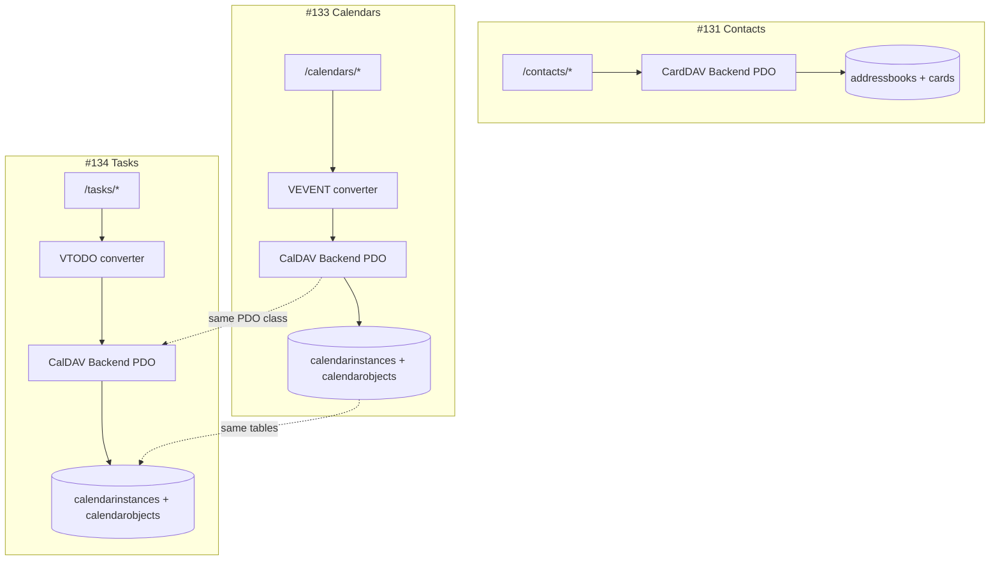

# Tasks API — Codebase Map (Contacts #131 + Calendars #133 → Tasks)

Tracking issue: [WeGotWorkspace/wegotworkspace#134](https://github.com/WeGotWorkspace/wegotworkspace/issues/134)

Implementation plan: [tasks-api-jmap-caldav.md](./tasks-api-jmap-caldav.md)

## Key finding

| Issue | Domain | DAV protocol | Storage tables | iCalendar / vCard component | REST prefix |
|-------|--------|--------------|----------------|----------------------------|-------------|
| **#131** | Contacts | CardDAV | `addressbooks`, `cards`, `addressbookchanges` | vCard (`.vcf`) | `/api/v1/contacts/*` |
| **#133** | Calendars | CalDAV | `calendars`, `calendarinstances`, `calendarobjects`, `calendarchanges` | `VEVENT` (`.ics`) | `/api/v1/calendars/*` |
| **#134** | Tasks/Todo | CalDAV (same backend) | **Same CalDAV tables** | **`VTODO`** (`.ics` in `calendarobjects`) | `/api/v1/tasks/*` |

**Tasks mirror Calendars (#133), not Contacts (#131).** Both events and todos live in `calendarobjects.calendardata`; the difference is the iCalendar component type (`VEVENT` vs `VTODO`) and the JMAP wire type (`CalendarEvent` vs `Task`). Task lists map to VTODO-capable `calendarinstances`, not separate task-list tables.



---

## Layer template (copy per domain)

Each domain follows the same REST layering documented in `.agents/skills/api/rest-design.md`:

```
HTTP Controller
  → Form Request (validate JMAP-shaped body)
  → Repository (CalPDO/CardPDO writes, Eloquent reads)
  → Mapper (DB row ↔ JMAP type)
  → Converter (iCalendar/vCard ↔ JMAP type)
  → SearchIndexerService (side effect on write)
```

| Layer | Contacts (#131) | Calendars (#133) | Tasks (#134) |
|-------|-----------------|------------------|--------------|
| **Controllers** | `Contacts/AddressBooksController`, `ContactCardsController` | `Calendars/CalendarsController`, `EventsController` | `Tasks/TaskListsController`, `TasksController`, `CapabilitiesController` |
| **Form requests** | `ContactCardUpsertRequest`, `ContactCardPatchRequest` | `CalendarEventUpsertRequest`, `CalendarEventPatchRequest` | `TaskUpsertRequest`, `TaskPatchRequest` |
| **Repository (collection)** | `AddressBookRepository` | `CalendarRepository` | `TaskListRepository` |
| **Repository (item)** | `ContactCardRepository` | `CalendarEventRepository` | `TaskRepository` |
| **Mapper** | `ContactCardMapper` | `CalendarEventMapper` | `TaskMapper` |
| **Converter** | `VCardJsContactConverter` (+ read/write split) | `IcsJmapCalendarEventConverter` | `IcsJmapTaskConverter` (+ `IcsToJmapTaskConverter`, `JmapToIcsTaskConverter`) |
| **PDO backend** | `Sabre\CardDAV\Backend\PDO` | `Sabre\CalDAV\Backend\PDO` | `Sabre\CalDAV\Backend\PDO` |
| **Eloquent models** | `Addressbook`, `Card` | `Calendar`, `CalendarInstance`, `CalendarObject` | Reuse `Calendar`, `CalendarInstance`, `CalendarObject` |
| **Feature gate middleware** | `EnsureContactsEnabled` (`wgw.contacts`) | `EnsureCalendarsEnabled` (`wgw.calendars`) | `EnsureTasksEnabled` (`wgw.tasks`) |
| **Setting key** | `contacts_enabled` | `calendar_enabled` | `tasks_enabled` (new) |
| **Test fixtures trait** | `ContactsTestFixtures` | `CalendarsTestFixtures` | `TasksTestFixtures` |
| **Interop test** | `ContactsCardDavInteropTest` | `CalendarsCalDavInteropTest` | `TasksCalDavInteropTest` |

---

## Contacts (#131) — reference implementation (landed)

Use as the **pattern reference** for middleware, OpenAPI modular schemas, feature-test structure, and CardDAV interop tests. Tasks differ in persistence (CalDAV not CardDAV).

### Routes (`packages/api/routes/api.php`)

```php
Route::middleware('wgw.contacts')->group(function (): void {
    Route::get('contacts/addressbooks', ...);
    Route::get('contacts/addressbooks/{addressBookId}', ...);
    Route::get('contacts/cards', ...);
    Route::post('contacts/cards', ...);
    Route::get('contacts/cards/{cardId}', ...);
    Route::put('contacts/cards/{cardId}', ...);
    Route::patch('contacts/cards/{cardId}', ...);
    Route::delete('contacts/cards/{cardId}', ...);
});
```

**Tasks equivalent:** `Route::middleware('wgw.tasks')->group(...)` with `/tasks/tasklists`, `/tasks/items`, `/tasks/capabilities`.

### Middleware registration (`packages/api/bootstrap/app.php`)

```php
'wgw.contacts' => EnsureContactsEnabled::class,
```

**Tasks:** add `'wgw.tasks' => EnsureTasksEnabled::class`.

### Controller pattern (`ContactCardsController.php`)

- Inject repository in constructor
- Read principal from `AuthenticateWgwApi::PRINCIPAL_ATTRIBUTE`
- Delegate to repository; return `JsonResponse`
- Upsert/patch use dedicated Form Request classes

### Repository write pattern (`ContactCardRepository.php`)

```php
$this->cardBackend()->createCard((int) $book->id, $cardUri, $vcard);
$this->searchIndexer->indexCardObjectFromPath($this->cardDavPath(...));
```

**Tasks equivalent:**

```php
$this->calBackend()->createCalendarObject($calendarId, $objectUri, $icsBlob);
$this->searchIndexer->indexCalendarObjectFromPath($this->calDavPath(...));
```

CalPDO methods: `createCalendarObject`, `updateCalendarObject`, `deleteCalendarObject`, `getCalendarObject`.

### OpenAPI (`packages/api/openapi/schemas/contacts/`)

| File | Purpose |
|------|---------|
| `address-book.json` | `AddressBook` + list wrapper |
| `contact-card.json` | `ContactCard` + list wrapper |
| `jscontact-*.json` | Modular nested types |
| `primitives.json` | Shared refs |

Merged into `openapi.json` paths with `x-wgw-access: user`.

**Tasks:** mirror under `openapi/schemas/tasks/` with `task-list.json`, `task.json`.

### Docs (`packages/api/docs/contacts/`)

| File | Purpose |
|------|---------|
| `rfc9610-summary.md` | JMAP Contacts field subset |
| `rfc9553-jscontact-types.md` | JSContact types |
| `rfc9555-conversion-matrix.md` | vCard ↔ JSContact mapping |

**Tasks:** `jmap-tasks-summary.md`, `ics-jmap-task-conversion-matrix.md`.

### Tests

| File | Covers |
|------|--------|
| `tests/Feature/Contacts/ContactsAddressBooksTest.php` | List/show address books |
| `tests/Feature/Contacts/ContactsCardsTest.php` | CRUD cards |
| `tests/Feature/Contacts/ContactsAccessControlTest.php` | Auth + `contacts_enabled` gate |
| `tests/Feature/Contacts/ContactsCardDavInteropTest.php` | REST ↔ CardPDO round-trip |
| `tests/Unit/Contacts/VCardJsContactConverterTest.php` | Converter |
| `tests/Support/ContactsTestFixtures.php` | CardPDO seed helpers |

**Tasks:** parallel under `tests/Feature/Tasks/`, `tests/Unit/Tasks/`, `tests/Support/TasksTestFixtures.php`.

---

## Calendars (#133) — primary template for Tasks

Calendars REST is the **closest sibling**: same CalPDO, same `calendarobjects` blob storage, same multi-component `.ics` id scheme, same recurrence master-only policy.

### Planned structure (from #133 — may be in progress)

| Path | Status | Tasks analogue |
|------|--------|----------------|
| `app/Services/Calendars/CalendarRepository.php` | planned | `TaskListRepository.php` — filter `Calendar::supportsVtodo()` |
| `app/Services/Calendars/CalendarEventRepository.php` | planned | `TaskRepository.php` — VTODO CRUD via CalPDO |
| `app/Services/Calendars/CalendarEventMapper.php` | planned | `TaskMapper.php` |
| `app/Services/Calendars/Conversion/IcsJmapCalendarEventConverter.php` | planned | `IcsJmapTaskConverter.php` |
| `app/Http/Middleware/EnsureCalendarsEnabled.php` | planned | `EnsureTasksEnabled.php` |
| `openapi/schemas/calendars/` | planned | `openapi/schemas/tasks/` |
| `docs/calendars/` | planned | `docs/tasks/` |

### Shared CalDAV baseline (read-only for Tasks)

| Path | Role |
|------|------|
| `resources/installer/sql/sqlite/calendars.sql` | Schema: `calendars.components` stores supported component types (`VEVENT,VTODO,VJOURNAL`) |
| `app/Dav/SabreServerFactory.php` | Wires `CalDAV\Backend\PDO` when `calendar_enabled` |
| `app/Dav/Server/AppCalendarRoot.php` | Principal-scoped calendar tree |
| `app/Models/Calendar.php` | `supportsVtodo()` — **Tasks task-list filter** |
| `app/Models/CalendarInstance.php` | Task list row (`uri` → `TaskList.id`) |
| `app/Models/CalendarObject.php` | Task storage row (`calendardata` → `.ics` with VTODO) |
| `app/Services/Search/SearchIndexerService.php` | `indexCalendarObjectFromPath()` — parses VTODO at line ~636 |

### Multi-component `.ics` id scheme (shared #133 ↔ #134)

| Operation | Calendars (`VEVENT`) | Tasks (`VTODO`) |
|-----------|---------------------|-----------------|
| Single component per `.ics` | `id` = uri without `.ics` | Same |
| Multiple components in one `.ics` | `{objectUri}#{veventUid}` | `{objectUri}#{vtodoUid}` |
| POST create | New row, single VEVENT | New row, single VTODO |
| PUT/PATCH/DELETE | Target one VEVENT; preserve siblings | Target one VTODO; preserve VEVENT siblings |

---

## Tasks (#134) — target file tree

Legend: ✅ exists · 🔲 to create · ♻️ reuse from calendars/contacts

```
packages/api/
├── docs/tasks/                                    🔲 Chunk 1
│   ├── jmap-tasks-summary.md
│   └── ics-jmap-task-conversion-matrix.md
├── openapi/schemas/tasks/                         🔲 Chunk 2
│   ├── task-list.json
│   ├── task.json
│   └── paths (or merged in openapi.json)
├── app/
│   ├── Http/
│   │   ├── Controllers/Api/V1/Tasks/
│   │   │   ├── CapabilitiesController.php         🔲 Chunk 4
│   │   │   ├── TaskListsController.php            🔲 Chunk 4
│   │   │   └── TasksController.php                🔲 Chunk 4
│   │   ├── Middleware/EnsureTasksEnabled.php      🔲 Chunk 4
│   │   └── Requests/Api/V1/
│   │       ├── TaskUpsertRequest.php              🔲 Chunk 5
│   │       └── TaskPatchRequest.php               🔲 Chunk 5
│   ├── Models/
│   │   ├── Calendar.php                           ♻️ supportsVtodo()
│   │   ├── CalendarInstance.php                   ♻️
│   │   └── CalendarObject.php                     ♻️
│   └── Services/Tasks/
│       ├── TaskListRepository.php                 🔲 Chunk 5
│       ├── TaskRepository.php                     🔲 Chunk 5
│       ├── TaskMapper.php                         🔲 Chunk 5
│       └── Conversion/
│           ├── IcsJmapTaskConverter.php           🔲 Chunk 3 (facade)
│           ├── IcsToJmapTaskConverter.php         ✅ partial
│           ├── JmapToIcsTaskConverter.php           ✅ partial
│           └── TaskConversionSupport.php            ✅ partial
├── routes/api.php                                 🔲 tasks route group
├── bootstrap/app.php                              🔲 wgw.tasks alias
├── tests/
│   ├── Feature/Tasks/
│   │   ├── TasksTaskListsTest.php                 ✅ Chunk 4
│   │   ├── TasksItemsTest.php                     ✅ Chunk 4
│   │   ├── TasksAccessControlTest.php             ✅ Chunk 4
│   │   └── TasksCalDavInteropTest.php             🔲 Chunk 6
│   ├── Unit/Tasks/
│   │   └── IcsJmapTaskConverterTest.php           🔲 Chunk 3
│   ├── Support/TasksTestFixtures.php              🔲 Chunk 4
│   └── fixtures/Tasks/*.ics                       🔲 Chunk 3
```

---

## VTODO-first storage details

### Task list discovery

```sql
-- Conceptual query (implement via Eloquent in TaskListRepository)
SELECT ci.*
FROM calendarinstances ci
JOIN calendars c ON c.id = ci.calendarid
WHERE ci.principaluri = 'principals/{username}'
  AND ci.access = 1  -- owner
  AND c.components LIKE '%VTODO%';
```

PHP: `CalendarInstance::query()->whereHas('calendar', fn ($q) => ...)` or join + `Calendar::supportsVtodo()`.

Default Sabre todo calendar: component-set often `VEVENT,VTODO,VJOURNAL` — task list endpoint returns instances where parent calendar supports VTODO (may overlap with calendar list from #133; different REST filter).

### Task object read

1. Load `CalendarObject` rows for calendar id
2. Parse `calendardata` with Sabre VObject
3. Extract all `VTODO` components via `getComponents('VTODO')`
4. Map each to JMAP `Task` with composite id when multiple VTODOs share one uri

### Task object write

1. Convert JMAP `Task` → single `VTODO` (+ optional `VCALENDAR` wrapper) via `JmapToIcsTaskConverter`
2. On update with composite id: load existing `.ics`, replace matching `VTODO` by UID, preserve other components
3. Write via `CalDAV\Backend\PDO::updateCalendarObject()` or `createCalendarObject()`
4. Reindex via `SearchIndexerService::indexCalendarObjectFromPath()`

### CalDAV path convention

Mirror calendars path helper (from `ContactsCardRepository::cardDavPath` pattern):

```
/calendars/{username}/{calendarUri}/{objectUri}.ics
```

---

## Settings & capabilities wiring

| Setting | Contacts | Calendars | Tasks |
|---------|----------|-----------|-------|
| `SettingKeys.php` | `CONTACTS_ENABLED` | `CALENDAR_ENABLED` | `TASKS_ENABLED` 🔲 |
| `WgwSettings.php` | `CONTACTS_ENABLED` | `CALENDAR_ENABLED` | `TASKS_ENABLED` 🔲 |
| `DavCapabilitiesService` | `contactsEnabled` | `calendarEnabled` | `tasksEnabled` 🔲 |
| `SabreServerFactory` | CardDAV plugin when enabled | CalDAV plugin when enabled | Same CalDAV plugin (VTODO included) |

Note: Tasks depend on CalDAV being enabled (`calendar_enabled`). `tasks_enabled` is an additional REST gate (like `contacts_enabled` gates REST but CardDAV plugin also checks the same flag).

---

## Search indexing

`SearchIndexerService` already handles VTODO in `parseCalendarObject()`:

```php
foreach (['VEVENT', 'VTODO', 'VJOURNAL'] as $component) {
    if (isset($vobject->$component)) {
        $target = $vobject->$component;
        break;
    }
}
```

First matching component wins. Multi-component `.ics` files may index only the first VEVENT/VTODO — document limitation; interop test should verify basic VTODO-only objects index correctly.

---

## OpenAPI / typegen wiring

Follow contacts pattern in `packages/api/scripts/typegen-openapi-types.mjs`:

1. Add tasks schema refs to build script
2. Generate `packages/api/openapi/generated/tasks-types.ts`
3. `pnpm --filter @wgw/api run typegen:check` validates drift

---

## Test fixture seeding (TasksTestFixtures)

Mirror `ContactsTestFixtures` but seed via CalPDO:

1. Create principal + user (reuse `WgwRoleFixtures`)
2. Set `tasks_enabled` + `calendar_enabled` app settings
3. Ensure VTODO-capable calendar instance exists (Sabre default or explicit CalPDO `createCalendar`)
4. Helper methods: `seedTodoCalendar()`, `createVtodoViaCalPdo()`, `userBearerToken()`

Reference: `ContactsTestFixtures::seedAddressBook()` uses `CardPDO::createAddressBook()`.

CalPDO equivalent: create calendar with `components` containing `VTODO`, then `createCalendarObject()` with `.ics` blob.

---

## Chunk agent handoff checklist

When picking up a chunk, load:

1. This codebase map — file locations and patterns
2. [tasks-api-jmap-caldav.md](./tasks-api-jmap-caldav.md) — chunk scope + AC
3. `.agents/skills/api/` — REST layering rules
4. Precedent diff: Contacts (#131) merged code under `app/Services/Contacts/`
5. For CalPDO specifics: read `ContactCardRepository` (write pattern) + #133 calendar repository when available

**Do not** copy CardDAV PDO for tasks — always use CalDAV PDO.

### Do NOT use (Notes / Flysystem)

Tasks are **VTODO in CalDAV `calendarobjects`**, not markdown files on Flysystem.

| Anti-pattern | Why |
|--------------|-----|
| `app/Services/Notes/NoteRepository.php` | Persists notes via `WgwStorage` / Flysystem — wrong store |
| `app/Http/Controllers/Api/V1/Notes/ItemsController.php` | Notes domain; only `/items` path naming is analogous |
| `.agents/skills/api/storage-flysystem.md` | Files/WebDAV storage — not CalDAV calendar blobs |

---

## References

- Issue #131: Contacts REST (CardDAV) — pattern for middleware, tests, OpenAPI
- Issue #133: Calendars REST (CalDAV VEVENT) — pattern for CalPDO, multi-component ids, recurrence
- Issue #134: Tasks REST (CalDAV VTODO) — this map
- [draft-ietf-jmap-tasks-06](https://datatracker.ietf.org/doc/draft-ietf-jmap-tasks/06/)
- [RFC 8984](https://www.rfc-editor.org/rfc/rfc8984) — JSTask
- [RFC 5545](https://www.rfc-editor.org/rfc/rfc5545) — VTODO
- [RFC 4791](https://www.rfc-editor.org/rfc/rfc4791) — CalDAV
