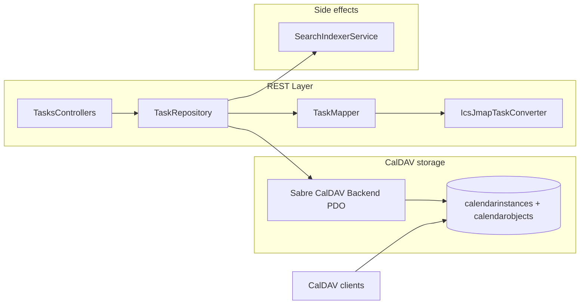

# Tasks/Todo REST API (JMAP Tasks + CalDAV VTODO)

Tracking issue: [WeGotWorkspace/wegotworkspace#134](https://github.com/WeGotWorkspace/wegotworkspace/issues/134)

Codebase map (Contacts/Calendars → Tasks template): [tasks-api-codebase-map.md](./tasks-api-codebase-map.md)

## Goal

Expose tasks/todos to the web client via **REST** under `/api/v1/tasks/*` while keeping **CalDAV (Sabre PDO)** as the persistence layer (`calendars`, `calendarinstances`, `calendarobjects`, `calendarchanges` on the `wgw` connection). Request/response bodies use **JMAP Tasks** types (`TaskList`, `Task` / JSTask from [RFC 8984](https://www.rfc-editor.org/rfc/rfc8984)) with bidirectional **iCalendar VTODO ↔ JMAP Task** conversion. API only — no tasks workspace UI in v1.

Parity target: [contacts REST (#131)](https://github.com/WeGotWorkspace/wegotworkspace/issues/131), [calendars REST (#133)](https://github.com/WeGotWorkspace/wegotworkspace/issues/133) — same layering, OpenAPI-first contract, PHPUnit feature + unit tests, CalDAV interop tests, and feature gate.

## Non-goals

- Full JMAP protocol (`Task/set`, `/changes`, `/query`, blob upload)
- JMAP Sharing — return `shareWith: null`, static `myRights` where applicable
- TaskList CRUD (create/rename/delete task lists via REST) in v1
- Replacing CalDAV or changing Sabre plugin wiring
- Tasks workspace app UI
- Server-side recurrence instance expansion
- JMAP Tasks extension capabilities in v1: `tasks:assignees`, `tasks:alerts`, `tasks:multilingual`, `tasks:customtimezones` (core only)
- `TaskNotification` / push notification history
- Mixed `VEVENT`+`VTODO` REST on the calendars API (events stay on `/calendars/*`; todos on `/tasks/*`)

## Affected packages

- `packages/api` — REST, OpenAPI, converter, repositories, tests, docs
- `.agents/plans/` — this file + codebase map

## JMAP Tasks spec reference (draft-ietf-jmap-tasks-06)

| Item | Detail |
|------|--------|
| IETF datatracker | [draft-ietf-jmap-tasks-06](https://datatracker.ietf.org/doc/draft-ietf-jmap-tasks/06/) |
| Full text | [draft-ietf-jmap-tasks-06.txt](https://www.ietf.org/archive/id/draft-ietf-jmap-tasks-06.txt) |
| HTML | [draft-ietf-jmap-tasks-06.html](https://www.ietf.org/archive/id/draft-ietf-jmap-tasks-06.html) |
| Status | Expired working draft (last updated 2023-09); JMAP WG milestone: IESG submission Jul 2026 |
| Core capability | `urn:ietf:params:jmap:tasks` |
| Object types | `TaskList`, `Task` (JSTask), `TaskNotification` (defer) |
| TaskList methods (full JMAP — defer) | `TaskList/get`, `TaskList/changes`, `TaskList/set` |
| Task methods (full JMAP — defer) | `Task/get`, `Task/changes`, `Task/set`, `Task/copy`, `Task/query`, `Task/queryChanges` |
| JSTask base | [RFC 8984](https://www.rfc-editor.org/rfc/rfc8984) (JSCalendar Tasks) |
| CalDAV alignment | Draft §1 — built on JMAP for Calendars; CalDAV [RFC 4791](https://www.rfc-editor.org/rfc/rfc4791) + VTODO [RFC 5545](https://www.rfc-editor.org/rfc/rfc5545) for dual access |

### draft-ietf-jmap-tasks-06 sections to distill (Chunk 1)

| Section | Relevance |
|---------|-----------|
| §1 Introduction | Dual CalDAV/JMAP access model; core vs extension capabilities |
| §2 Conventions | Same as JMAP for Calendars unless stated |
| §3 TaskLists | `TaskList` properties; maps to VTODO-capable `calendarinstances` |
| §4 Tasks | Core JSTask subset + JMAP fields (`id`, `taskListId`, `workflowStatus`, `sortOrder`) |
| §4.4 Recurrences | Master-only in v1 REST; defer `tasks:recurrences` extension advertisement |
| §5 TaskNotifications | Defer entirely |
| §6 Methods | Reference only — REST v1 exposes CRUD equivalents, not JMAP batch methods |

### CalDAV VTODO-first storage strategy

Tasks **reuse CalDAV tables**, not a separate tasks store:

| Layer | Storage |
|-------|---------|
| Task list | `calendarinstances` row whose parent `calendars.components` includes `VTODO` |
| Task object | `VTODO` component inside `calendarobjects.calendardata` (`.ics` blob) |
| Writes | **Sabre `CalDAV\Backend\PDO`** — same backend as events; never raw Eloquent writes on `calendarobjects` |
| Reads | Eloquent `CalendarInstance` / `CalendarObject` for listing; CalPDO for create/update/delete |
| Sync token | `calendarchanges` updated by CalPDO on write (existing Sabre behavior) |
| Search | `SearchIndexerService::indexCalendarObjectFromPath` — already parses `VTODO` for title/body |

Filter task lists: join `calendarinstances` → `calendars` where `calendars.components` contains `VTODO` (see `Calendar::supportsVtodo()`).

### CalDAV VTODO ↔ JMAP Task (property mapping)

| JMAP | CalDAV / iCalendar |
|------|-------------------|
| `TaskList` | VTODO-capable `calendarinstances` row |
| `TaskList.id` | `calendarinstances.uri` |
| `Task` | `VTODO` component in `calendarobjects.calendardata` |
| `Task.uid` | `UID` property |
| `Task.title` | `SUMMARY` |
| `Task.description` | `DESCRIPTION` |
| `Task.start` / `due` | `DTSTART` / `DUE` (or `DURATION`) |
| `Task.timeZone` | `VTIMEZONE` / floating semantics |
| `Task.priority` | `PRIORITY` (mapped per JMAP/JSTask) |
| `Task.workflowStatus` | `STATUS` (`NEEDS-ACTION`, `IN-PROCESS`, `COMPLETED`, `CANCELLED`) + `PERCENT-COMPLETE` → `progress` |
| `Task.recurrenceRules` | `RRULE` (master-only in v1 REST; no server expansion) |
| `Task.taskListId` | owning calendar instance uri |

**Multi-VTODO `.ics`:** mirror calendars multi-`VEVENT` design (#133): composite id `{objectUri}#{vtodoUid}` on read; create always writes single-`VTODO` object; update/delete targets one component; preserve sibling `VEVENT`/`VJOURNAL`.

## Dependencies

1. **Calendars REST (#133)** should land first or in parallel on a separate branch — shared CalPDO patterns, `CalendarInstance` / `CalendarObject` models, search indexer calendar paths. Tasks chunk can reuse CalPDO wiring but must not block on calendars PR merge if worktrees are isolated.
2. Chunk 1 (spec corpus) has no deps.
3. Chunk 2 (OpenAPI) depends on Chunk 1 field subset decisions.
4. Chunk 3 (converter) depends on Chunk 1; parallel with Chunk 2 after field list is frozen.
5. Chunk 4 (contract + failing tests) depends on Chunk 2.
6. Chunk 5 (CRUD) depends on Chunks 3 + 4.
7. Chunk 6 (interop + verify) depends on Chunk 5.

## REST endpoints (v1)

OpenAPI contract uses **`/tasks/items`** for task CRUD (avoids `/tasks/tasks`; aligns with `/notes/items` naming). Schemas already exist under `openapi/schemas/tasks/`.

| Method | Path | Purpose | Response shape |
|--------|------|---------|----------------|
| `GET` | `/tasks/capabilities` | Tasks feature flags + JMAP subset advertisement (optional v1) | `{ … }` |
| `GET` | `/tasks/tasklists` | List user's task lists | `{ list: TaskList[] }` |
| `GET` | `/tasks/tasklists/{taskListId}` | Single task list | `TaskList` |
| `GET` | `/tasks/items?taskListId={id}` | All tasks in one list | `{ list: Task[] }` |
| `GET` | `/tasks/items/{taskId}` | Single task | `Task` |
| `POST` | `/tasks/items` | Create task | `Task` (201) |
| `PUT` | `/tasks/items/{taskId}` | Replace task | `Task` |
| `PATCH` | `/tasks/items/{taskId}` | Partial update (e.g. status, due) | `Task` |
| `DELETE` | `/tasks/items/{taskId}` | Delete task | `{ ok: true }` |

**Access:** `x-wgw-access: user` inside `wgw.auth` + `wgw.role:user`; **403** when `tasks_enabled` is false (new setting, mirror `calendar_enabled` / `contacts_enabled`).

**ID mapping:** `TaskList.id` = `calendarinstances.uri` (VTODO-capable calendars only); `Task.id` = object uri without `.ics` (single-VTODO create) or `{objectUri}#{vtodoUid}` (multi-VTODO read); principal = `principals/{username}`.

## Design decisions (normative)

### Multi-VTODO `.ics` files

Mirror [calendars REST (#133)](https://github.com/WeGotWorkspace/wegotworkspace/issues/133) multi-`VEVENT` rules:

- **Read (`GET` list/show):** Split each `VTODO` in a `calendarobjects.calendardata` blob into its own JMAP `Task`; composite id `{objectUri}#{vtodoUid}` when multiple VTODOs share one `.ics`.
- **Create (`POST`):** Always create a new `calendarobjects` row with a **single** `VTODO`; response id = object uri without `.ics`.
- **Update (`PUT`/`PATCH`):** Target one VTODO by composite id; merge into the `.ics`; preserve sibling `VTODO`s and ignore `VEVENT` components.
- **Delete (`DELETE`):** Remove the targeted `VTODO` from the `.ics`; delete the row when no VTODO remains.

Document in `packages/api/docs/tasks/ics-jmap-task-conversion-matrix.md`.

### Recurring tasks

- Return **master** tasks with `recurrenceRules` — no server-side instance expansion in `GET` list/show.
- Converter round-trips `RRULE` (and documented related fields); gaps listed in conversion matrix.

### Persistence boundary

- **CalPDO only for writes** — do not use Notes/Flysystem (`NoteRepository`, `WgwStorage`).
- Eloquent models (`Calendar`, `CalendarInstance`, `CalendarObject`) for reads/joins only.

## Implementation chunks (parallel agents)

Sequential dependencies — OpenAPI + failing tests before implementation; converter green before CRUD.

### Chunk 1 — Spec corpus (RFC / draft distill)

- **Skill:** `api`, `document`
- **Inputs:** draft-ietf-jmap-tasks-06, RFC 8984, RFC 5545 VTODO, RFC 4791, calendars/contacts doc patterns
- **Files:**
  - `packages/api/docs/tasks/jmap-tasks-summary.md` — TaskList/Task field subset for this API
  - `packages/api/docs/tasks/ics-jmap-task-conversion-matrix.md` — VTODO ↔ JMAP property mapping, STATUS/workflowStatus, multi-VTODO, recurrence notes
- **Done when:** Field subset documented; conversion matrix lists supported + explicitly deferred properties; multi-VTODO id scheme matches #133 pattern
- **Parallel with:** none (blocks OpenAPI field names)

### Chunk 2 — OpenAPI schemas + TS typegen

- **Skill:** `api`
- **Inputs:** Chunk 1 field subset; `packages/api/openapi/schemas/contacts/` and `calendars/` as templates
- **Files:**
  - `packages/api/openapi/schemas/tasks/task-list.json`
  - `packages/api/openapi/schemas/tasks/task.json`
  - `packages/api/openapi/schemas/tasks/paths.json` (or inline in openapi.json)
  - `packages/api/openapi/openapi.json` — merge paths + components
  - `packages/api/openapi/generated/tasks-types.ts` (via typegen script)
  - `packages/api/scripts/typegen-openapi-types.mjs` — wire tasks types
- **Done when:** All eight core REST operations in OpenAPI with `x-wgw-access: user` (capabilities optional); wire tasks in `typegen-openapi-types.mjs`; `pnpm --filter @wgw/api run typegen:check` green after commit of generated artifacts
- **Parallel with:** Chunk 3 (after Chunk 1)

### Chunk 3 — ICS VTODO ↔ JMAP Task converter (unit tests first)

- **Skill:** `api`, `testing`
- **Inputs:** Chunk 1 conversion matrix; Sabre VObject; partial stubs exist under `app/Services/Tasks/Conversion/`
- **Files:**
  - `packages/api/app/Services/Tasks/Conversion/IcsJmapTaskConverter.php` (facade over read/write converters)
  - `packages/api/app/Services/Tasks/Conversion/IcsToJmapTaskConverter.php` (exists — extend)
  - `packages/api/app/Services/Tasks/Conversion/JmapToIcsTaskConverter.php` (exists — extend)
  - `packages/api/app/Services/Tasks/Conversion/TaskConversionSupport.php` (exists — extend)
  - `packages/api/tests/Unit/Tasks/IcsJmapTaskConverterTest.php`
  - `packages/api/tests/fixtures/Tasks/*.ics`, `*.json`
- **Done when:** `phpunit --filter IcsJmapTaskConverterTest` green — single-VTODO round-trip, multi-VTODO read split, STATUS/workflowStatus, due/start, recurrence master round-trip (at least RRULE)
- **Parallel with:** Chunk 2

### Chunk 4 — REST contract + failing feature tests

- **Skill:** `api`, `testing`
- **Inputs:** Chunk 2 OpenAPI paths
- **Files:**
  - `packages/api/routes/api.php` — tasks route group
  - `packages/api/bootstrap/app.php` — register `wgw.tasks` middleware alias
  - `packages/api/app/Http/Middleware/EnsureTasksEnabled.php`
  - `packages/api/app/Services/Settings/SettingKeys.php` — `TASKS_ENABLED`
  - `packages/api/app/Support/WgwSettings.php` — constant
  - `packages/api/app/Services/Dav/DavCapabilitiesService.php` — add `tasksEnabled`
  - `packages/api/app/Http/Controllers/Api/V1/Tasks/CapabilitiesController.php`
  - `packages/api/app/Http/Controllers/Api/V1/Tasks/TaskListsController.php`
  - `packages/api/app/Http/Controllers/Api/V1/Tasks/TasksController.php` (handles `/tasks/items`)
  - `packages/api/tests/Feature/Tasks/TasksTaskListsTest.php`
  - `packages/api/tests/Feature/Tasks/TasksItemsTest.php`
  - `packages/api/tests/Feature/Tasks/TasksAccessControlTest.php`
  - `packages/api/tests/Support/TasksTestFixtures.php`
- **Done when:** Routes registered; stub controllers return **501**; feature tests fail for wrong reason (not missing route); `composer done-gate:contract` passes; access tests for `tasks_enabled` gate pass
- **Parallel with:** none (needs Chunk 2)

### Chunk 5 — Laravel CRUD implementation

- **Skill:** `api`
- **Inputs:** Chunks 3 + 4
- **Files:**
  - `packages/api/app/Services/Tasks/TaskListRepository.php`
  - `packages/api/app/Services/Tasks/TaskRepository.php`
  - `packages/api/app/Services/Tasks/TaskMapper.php`
  - `packages/api/app/Http/Requests/Api/V1/TaskUpsertRequest.php`
  - `packages/api/app/Http/Requests/Api/V1/TaskPatchRequest.php`
  - Controllers — wire repositories
  - `packages/api/docs/sql-schema.md` — document calendar tables used for VTODO
  - Reuse: `packages/api/app/Models/Calendar.php`, `CalendarInstance.php`, `CalendarObject.php`
- **Done when:** All Tasks feature tests pass; CalPDO writes only; search reindex via `SearchIndexerService::indexCalendarObjectFromPath` for VTODO
- **Parallel with:** none

### Chunk 6 — CalDAV interop + cross-chunk verify

- **Skill:** `api`, `testing`, `code-review`
- **Inputs:** Chunk 5
- **Files:**
  - `packages/api/tests/Feature/Tasks/TasksCalDavInteropTest.php`
- **Done when:**
  - REST create → `calendarobjects` blob contains expected VTODO
  - REST create → search `sources[]=caldav` includes task (indexer already handles VTODO)
  - CalDAV PDO write → REST GET reflects JMAP fields
  - Multitask verifier checklist (`.agents/skills/developer/multitask-verifier.md`)
  - `composer done-gate` green; smells scan on touched files
- **Parallel with:** none

### Chunk parallelization matrix

| Chunk | Focus | Depends on | Parallel with |
|-------|-------|------------|---------------|
| 1 | Spec corpus (`docs/tasks/`) | — | — |
| 2 | OpenAPI + typegen | 1 | 3 |
| 3 | `IcsJmapTaskConverter` + unit tests | 1 | 2 |
| 4 | Routes, middleware, failing feature tests | 2 | — |
| 5 | Repository + CRUD | 3, 4 | — |
| 6 | CalDAV interop + verify | 5 | — |

## Acceptance criteria

### Git workflow

- **AC-1:** Work on dedicated feature branch (e.g. `feat/tasks-rest-api`) in separate git worktree — not on `main` or other in-flight feature branches.
- **AC-2:** Multiple small, auditable Conventional Commits (not one squashed mega-commit).
- **AC-3:** PR opened referencing #134 (`Closes #134`) with summary and test plan.

### REST API

- **AC-4:** All nine REST endpoints registered in `routes/api.php` with `x-wgw-access: user` in OpenAPI and enforced by `RoleAccessMatrixTest` (task CRUD at `/tasks/items`, not `/tasks/tasks`).
- **AC-5:** `GET /tasks/tasklists` and `GET /tasks/tasklists/{taskListId}` return JMAP-shaped `TaskList` objects scoped to authenticated principal (VTODO-capable calendars only).
- **AC-6:** `GET /tasks/items?taskListId={id}` returns `{ list: Task[] }` for owned task list; missing/foreign list returns **404**.
- **AC-7:** `GET /tasks/items/{taskId}` returns single `Task`; unknown id returns **404**.
- **AC-8:** `POST /tasks/items` creates task (201), requires `taskListIds`, writes via CalPDO, returns created `Task`.
- **AC-9:** `PUT` and `PATCH /tasks/items/{taskId}` update owned task and return updated `Task`.
- **AC-10:** `DELETE /tasks/items/{taskId}` deletes targeted task and returns `{ ok: true }`.
- **AC-11:** When `tasks_enabled` is false, all `/api/v1/tasks/*` routes return **403** (mirror `EnsureContactsEnabled`).

### Multi-VTODO ICS (design AC)

- **AC-12:** Reading `.ics` with multiple `VTODO` components yields multiple `Task` objects with ids `{objectUri}#{vtodoUid}`.
- **AC-13:** `POST` always creates new `calendarobjects` row with single `VTODO`; response id equals object uri without `.ics`.
- **AC-14:** `PUT`/`PATCH`/`DELETE` on composite id updates or removes only targeted `VTODO`; deleting last `VTODO` removes `calendarobjects` row.
- **AC-15:** Multi-VTODO mapping and CRUD rules documented in `packages/api/docs/tasks/`.

### Recurrence (design AC)

- **AC-16:** `GET` list/show returns master tasks with recurrence rules — **no** server-expanded recurrence instances.
- **AC-17:** Converter round-trips `RRULE` (and documented related fields) between ICS and JMAP `Task`; gaps documented in conversion matrix.
- **AC-18:** At least one unit test proves recurrence master round-trip (ICS → JMAP → ICS).

### CalDAV ↔ JMAP conversion

- **AC-19:** Bidirectional converter exists under `app/Services/Tasks/Conversion/` with unit test coverage.
- **AC-20:** `TasksCalDavInteropTest` proves REST create/update readable from `calendarobjects.calendardata` and search index; CalDAV-side write visible via REST `GET`.
- **AC-21:** `workflowStatus` ↔ `STATUS` mapping covered by converter tests.

### OpenAPI & types

- **AC-22:** Modular OpenAPI schemas under `openapi/schemas/tasks/` merged into built spec with request/response schemas on all operations.
- **AC-23:** `pnpm --filter @wgw/api run typegen:check` passes.

### Tests & quality gates

- **AC-24:** `tests/Feature/Tasks/*` and `tests/Unit/Tasks/*` exist and pass.
- **AC-25:** `composer done-gate:contract` passes.
- **AC-26:** `composer done-gate` passes in `packages/api`.
- **AC-27:** New/changed PHP under `app/Services/Tasks/`, controllers, and requests has meaningful test coverage.

### Documentation

- **AC-28:** `packages/api/docs/tasks/` contains JMAP Tasks summary + ICS↔JMAP conversion matrix (multi-VTODO, recurrence, STATUS sections).
- **AC-29:** `packages/api/docs/sql-schema.md` documents calendar tables/models used for VTODO REST.

## File touch list (summary)

| Area | Paths |
|------|-------|
| Docs | `packages/api/docs/tasks/` |
| OpenAPI | `packages/api/openapi/schemas/tasks/`, `openapi.json`, generated TS |
| Services | `packages/api/app/Services/Tasks/` |
| Models | `Calendar.php`, `CalendarInstance.php`, `CalendarObject.php` (read; may extend) |
| HTTP | `packages/api/app/Http/Controllers/Api/V1/Tasks/`, `Requests/`, `Middleware/EnsureTasksEnabled.php` |
| Routes | `packages/api/routes/api.php`, `bootstrap/app.php` |
| Settings | `SettingKeys.php`, `WgwSettings.php`, `DavCapabilitiesService.php` |
| Tests | `tests/Unit/Tasks/`, `tests/Feature/Tasks/`, `tests/Support/TasksTestFixtures.php`, `tests/fixtures/Tasks/` |
| Search | `SearchIndexerService.php` (verify VTODO indexing — already parses VTODO) |
| CalDAV baseline | `app/Dav/Server/AppCalendarRoot.php`, `resources/installer/sql/sqlite/calendars.sql` (read-only reference) |

## Test strategy

| Layer | Command / file |
|-------|----------------|
| Converter round-trip | `phpunit --filter IcsJmapTaskConverterTest` |
| REST CRUD + auth | `tests/Feature/Tasks/*` |
| CalDAV interop | `tests/Feature/Tasks/TasksCalDavInteropTest.php` |
| Contract parity | `composer done-gate:contract` |
| Role matrix | `tests/Architecture/RoleAccessMatrixTest.php` (auto via OpenAPI annotations) |
| Full API gate | `composer done-gate` |
| TS types | `pnpm --filter @wgw/api run typegen:check` |

**Test-first order:** OpenAPI paths → failing feature tests (501 stubs) → converter unit tests → implement CRUD → interop tests.

**Fixtures:** Golden `.ics` files for simple todo, completed todo, recurring master, multi-VTODO blob; JSON expected Task shapes.

**Manual smoke (optional):** create task via REST → CalDAV client sees VTODO; complete via CalDAV PUT → REST GET shows `workflowStatus: completed`.

## Risks

| Risk | Mitigation |
|------|------------|
| JMAP Tasks draft expired / may change | Pin to draft-06; document deltas; core-only v1 |
| TaskList vs Calendar instance ambiguity | Filter task lists to calendars with VTODO in component-set; document in spec corpus |
| Multi-VTODO + mixed VEVENT `.ics` | Tasks API ignores VEVENT; update preserves sibling components |
| STATUS / workflowStatus semantic drift | Conversion matrix with explicit enum mapping; golden fixtures |
| Overlap with calendars REST (#133) | Separate route prefix; shared CalPDO helpers extracted only when both land |
| No `tasks_enabled` flag yet | Add setting + DAV capabilities parity in Chunk 4 |
| Recurrence expansion scope creep | Explicit non-goal; AC-16 enforces master-only responses |

## Existing work in tree

| Status | Artifact |
|--------|----------|
| Done | OpenAPI schemas + paths (`/tasks/tasklists`, `/tasks/items`, `/tasks/capabilities`) |
| Done | Models `Calendar`, `CalendarInstance`, `CalendarObject` |
| Done | Routes, controllers, middleware, feature tests (implementation in progress) |
| Done | `TaskListRepository`, `TaskRepository`, `TaskMapper`, converter stubs |
| Not done | Spec corpus (`docs/tasks/`), full converter round-trip tests, CalDAV interop, `composer done-gate` green |

## Doc updates

- `packages/api/docs/tasks/` (required by AC)
- `packages/api/docs/sql-schema.md` (calendar tables for VTODO)
- `.agents/plans/tasks-api-codebase-map.md` (planning — keep in sync when layout changes)
- Do not add workspace UI docs in v1
